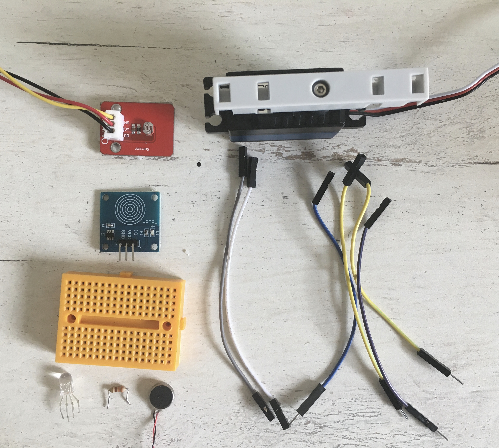
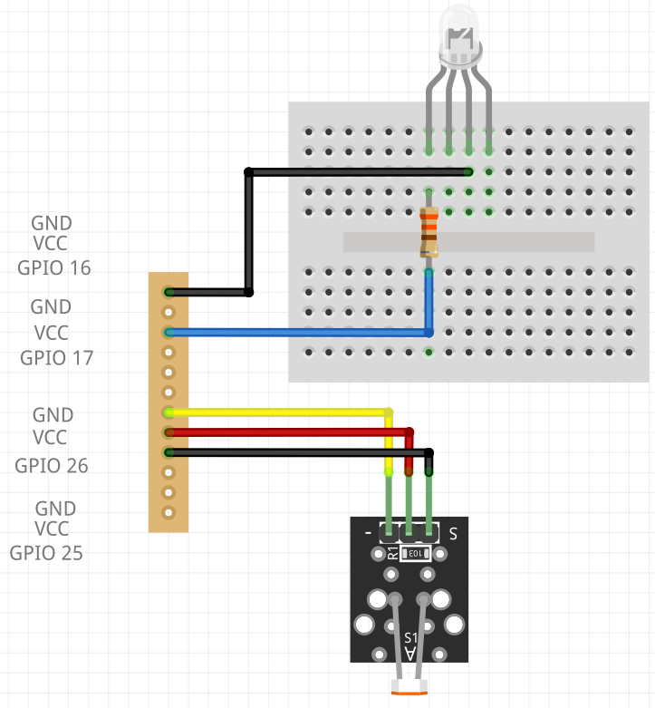
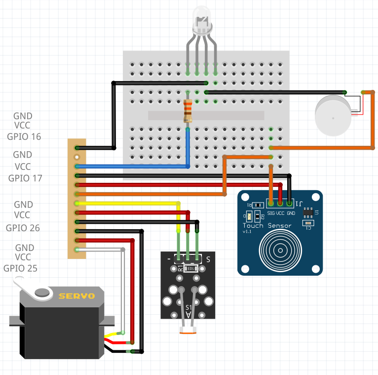

# STEP-BY-STEP
# Environment


Chameleons are sensitive animals. The color of their skin depends on their moods and the environment. The chameleons is a stressed animal, for example abrupt movements should be avoided. In this project you will recreate different behaviors. For this you will use the light sensor to determine the time of day. Using a touch sensor you will simulate the presence of a predator.

## Objective
* You can control an LED with signals.
* You can write while-loops.
* You can write for-loops.
* You can write if structure.
* You learn how to use a touch sensor.
* You learn how to use a light sensor.
* You learn how to control a servomotor.
* You learn to deal with global and local variables.

## Material 
* 1 Microcontroller ESP32
* 1 Breadboard (orange)
* 12 Jumper cables
* 1 RGB LED
* 1 resistor 330 Ohm
* 1 Touch sensor (blue)
* 1 Light sensor (red)
* 1 Vibrating motor (black)
* 1 Servomotor (waterproof)
* 1 3D printed part of: 3D_Structure_Light_sensor.stl (download on github)
* 1 3D printed part of: Light_Box_Top.stl (download on github)
* 1 3D printed part of: Light_Box_Bottom.stl (download on github)
* 2 Cable ties
* *CHAMELEON_Environment_Code_Challenge.ino* (download on github)

*Throughout the tutorial, do not hesitate to refer to the documentation.*

# Task 1: Control LEDs and create a snoring
Use two LEDs with different control methods, one LED is built in the ESP32 and the second is a RGB LED. The RGB LED brings together 3 simple LEDs, please use only the blue pin here. Control the power supply of the LED. The ESP32 only send information to the LED. The LED send no data back to the ESP32. 
<br> <br>(C) This image was created with Fritzing.

## Wiring scheme:
The picture shows the assembly of the breadboard (grey), LED RGB (clear), 330 Ohm resistor, and ESP32 (brown) with cables.
 <br>(C) This image was created with Fritzing.

LED RGB| ESP32 
------------ | -------------
Blue | GPIO 16 
Black | GND

<br>*The LED must be in series with a 330 Ohm resistor.*

## Code:
1. Open the *CHAMELEON_Environment_Code_Challenge.ino*  file.
<br>*Don't hesitate to consult the documentation to better understand the functions used.*
2. *global variables*
<br>In order to simplify understanding of the code, a global variable is associated with each GPIO number used. Associate the variabe "PIN_LED_B" to the number's GPIO 16. 
3. *setup()*
<br>First, indicate the GPIOs mode. Then you may notice instructions regarding the serial link. Do not hesitate to open the serial monitor.
4. *loop()*
<br>There are two diffrent methods to control a LED: 
* Power on or off the LED thanks to the *digitalWrite* function. It's a binary function. 
* Light the LED with different intensity via a PWM signal with the *ledcWrite(Channel_LED,i)* function. The variable i is between 0 and 256. Level zero turns off the 
LED and the level 256 is the highest level of brightness. 
<br>Please, complete the level to flash the red LED.
<br>The for-loops allows to create a snoring with the blue LED. 

# Task 2: Light sensor 
Use the luminosity sensor and send to it OUT pin an analog value proportional to the amount of light.  The luminosity sensor has 3 pins: ground (GND), power supply (VCC) and data pin connection (OUT). 
<br> <br>(C) This image was created with Fritzing.
 
## Wiring scheme: 
The picture shows the assembly of the breadboard (grey), LED RGB (clear), 330 Ohm resistor, the light sensor (black) and ESP32 (brown) with cables.
<br> <br>(C) This image was created with Fritzing.

LED RGB| Breadbord
------------ | -------------
Blue | GPIO 16 
Black | GND

Light sensor | ESP32
------------ | -------------
OUT | GPIO 26
VCC | VCC
GND | GND

## Code: 
1. *global variables* 
<br>Please indicate the numbers of the new GPIO used for the OUT pin of luminosity sensor. In addition, create a global variable that will stock the value of the limit of the amount of light between day and night, please. I'd advise you to put the value of 400.
<br> *This value can be modified depends on the room's light.*
2. *setup()*
<br>Please indicate the mode of the new GPIO used. 
<br> *The ESP32 receives information from the OUT pin.*
3. *loop()* 
<br>Please read the data from the luminosity sensor on the OUT pin and display on the serial monitor.

```
//Reading and display the light value
int Luminosity_Value = analogRead(PIN_LIGHT);
Serial.println("Light value");
Serial.println(Luminosity_Value,DEC);
```

The value of the variable will be compared to the limit between day and night defined before. If the value is superior than or equal to the limit, please light up the red LED, otherwise do a snoring with the blue LED.
<br>*Don't hesitate to consult the documentation to better understand how to use the conditions structure.*

# Task 3: Servo motor
Control the servomotor and create a movement of the tongue to convert a moment of activity of the chameleon. The servomotor has 3 pins: ground (black), power supply (red) and data pin connection (white).

## Wiring scheme: 
The picture shows the assembly of the breadboard (grey), LED RGB (clear), 330 Ohm resistor, the light luminosity (black), a servomotor and ESP32 (brown) with cables.
<br> <br>(C) This image was created with Fritzing.

LED RGB| Breadbord
------------ | -------------
Blue | GPIO 16 
Black | GND

Light sensor | ESP32
------------ | -------------
OUT | GPIO 26
VCC | VCC
GND | GND

Servomotor | ESP32
------------ | -------------
White | GPIO 25
Red | VCC
Black  | GND

## Code:
1.  *setup()* 
<br>Please indicate the mode of the servomotor.
<br>*ESP32 sends information to the servomotor.*
<br>Please position the servomotor initial with the *Command_servo* function. I'd advise you to put the value of 80. This value can be modified throughout the project.
2. *function*
<br>Please complete the *movement_tongue* function to create a movement of the tongue to convert a moment of activity of the chameleon.
<br>For example: 

```
void movement_tongue()
{
 Command_servo(120);
 delay(1000);
 Command_servo(80);
 delay(1000);
}
```

3. *loop()*
<br>Please call the *movement_tongue* function if it is the day.
 
# Task 4: Touch sensor 
Use the vibration motor and connect it with the OUT pin of the touch sensor. Implement, that the motor will vibrate each time a contact is detected. 
<br>The touch sensor send a high level when a touch is detected. The touch sensor has 3 pins: ground (GND), power supply (VCC) and data pin connection (I/O).
<br> <br>(C) This image was created with Fritzing. <br> <br>(C) This image was created with Fritzing.

## Wiring scheme: 
The picture shows the assembly of the breadboard (grey), LED RGB (clear), 330 Ohm resistor, the light luminosity (black), a servomotor, the touch sensor (blue), the vibrating motor (grey) and ESP32 (brown) with cables.
<br> <br>(C) This image was created with Fritzing.

LED RGB| Breadbord
------------ | -------------
Blue | GPIO 16 
Black | GND

Light sensor | ESP32
------------ | -------------
OUT | GPIO 26
VCC | VCC
GND | GND

Servomotor | ESP32
------------ | -------------
White | GPIO 25
Red | VCC
Black  | GND

Touch sensor| ESP32
------------ | -------------
I/O | GPIO 17
VCC | VCC
GND  | GND

<br> *The vibrating motor and the touch sensor was connected via the breadboard.*
<br>

## Code: 
1. *global variables* 
<br>Please indicate the numbers of the new GPIOs used for touch sensor.
2. *setup()* 
<br>Please indicate the mode of the touch sensor.
<br>  *ESP32 receives information from the touch sensor.*
3. *loop()*
<br>Please read and display the sensor's value.

```
//Reading an display the touch sensor's value
int  State_Touch = digitalRead(PIN_TOUCH);
Serial.println("State touch");
Serial.println(State_Touch);
```

# Task 5: Final code
Create the final code and use the touch sensor to simulate a danger (presence of a predator).

## Wiring scheme: 
The Wiring scheme is the same as in task 4.

## Code: 
1. *loop()*
<br>Please write the code to create the following situation: as long as no contact has been detected the red LED will light up, if it is daytime and the blue LED will 
light up if it is nighttime.
If the touch sensor detects a contact, the red LED will flash to warn of a danger.

```
//Danger
Serial.println("Danger");
ledcWrite(Channel_LED,0);
digitalWrite(PIN_LED_R,HIGH);
delay(300);
digitalWrite(PIN_LED_R,LOW);
delay(300);
```

<br>*Don't hesitate to consult the documentation to better understand how to use the while loop.* 
<br><br>Congratulations, you've coded the **Environment** scenario successfully!
