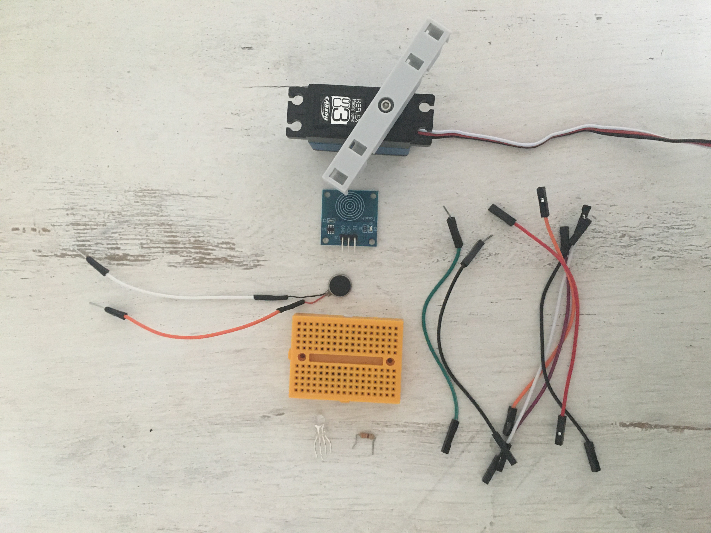
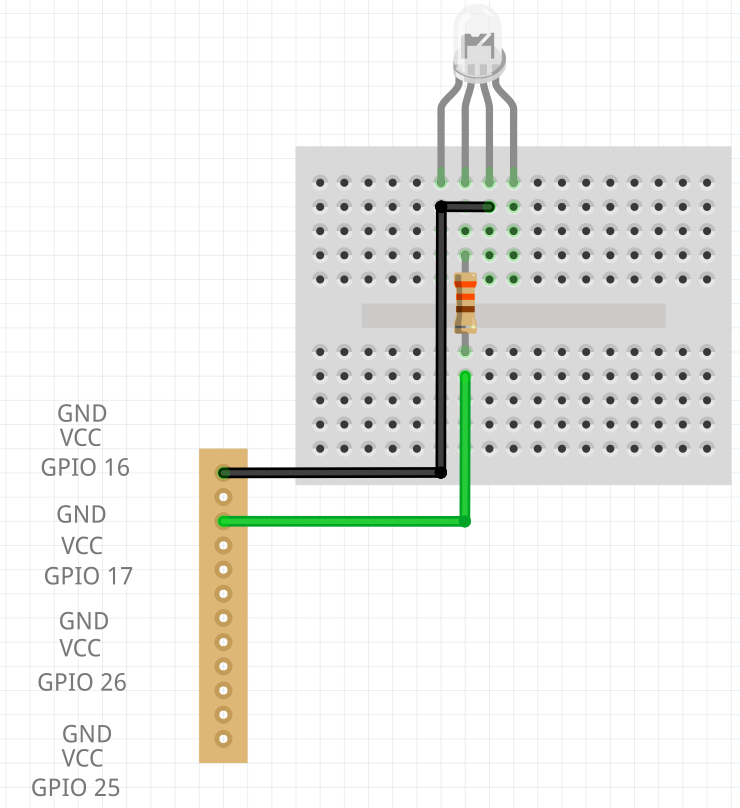
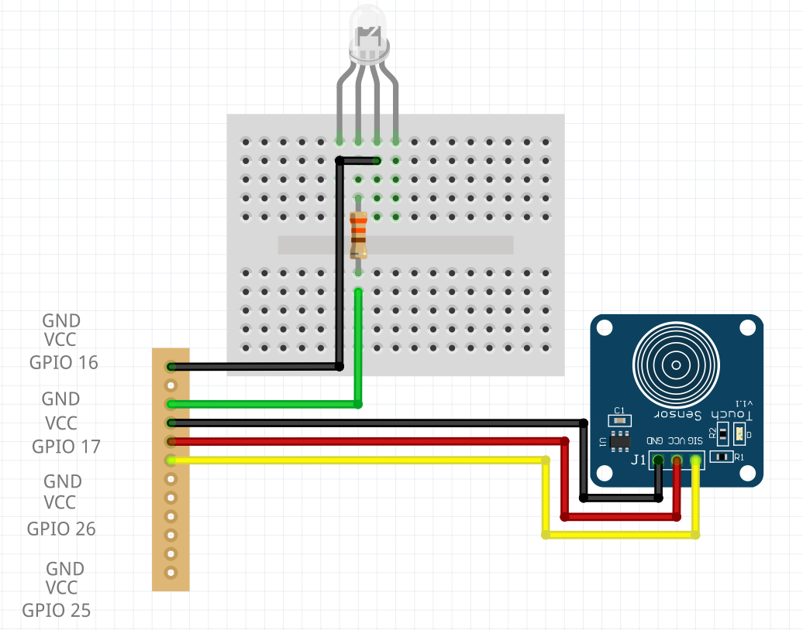
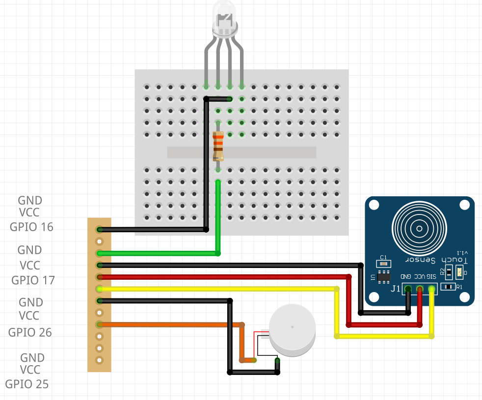
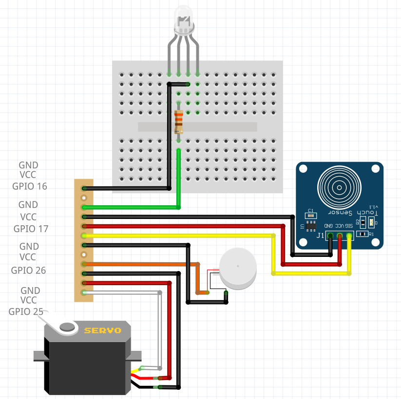
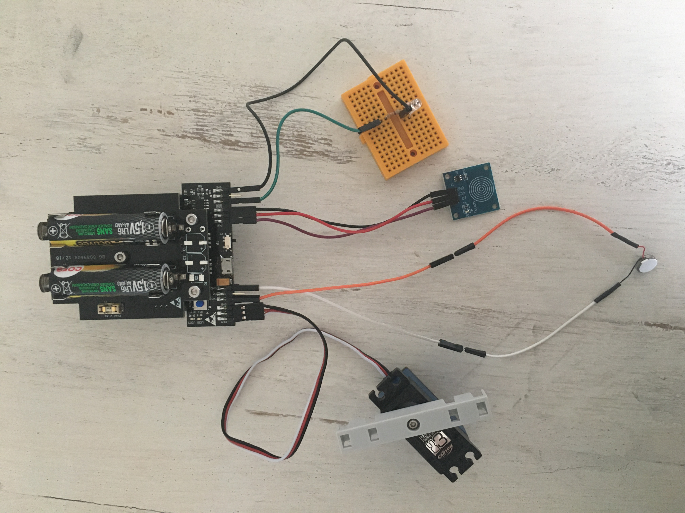

# STEP-BY-STEP 
# Food


In this project, you’re going to feed the chameleon. But be careful, food is very important for the cameleon to be healthy. In turn, using the touch sensor, you’re going to tell the cameleon you want to give him food. If the chameleon likes food, you win. Otherwise, the chameleon rejects the food.

## Objective
* You can control an LED with signals.
* You can write if structure.
* You can write for-loop.
* You can write while-loop.
* You learn how to use a touch sensor.
* You learn how to control a vibrating motor.
* You learn how to control a servomotor.
* You learn to deal with global and local variables.

## Material 
* 1 Microcontroller ESP32
* 1 Breadboard (orange)
* 9 Jumper cables
* 1 RGB LED
* 1 Resistor 330 Ohm
* 1 Vibrating motor (black)
* 1 Touch sensor (blue)
* 1 Servomotor (Waterproof)
* 3 Soft balls: diameter about 2,5 cm; color: blue, red, green
* *CHAMELEON_Food_Code_Challenge.ino* (download on github)


 *Throughout the tutorial, do not hesitate to refer to the documentation.*

# TASK 1: Flashing LED 
Use the RGB LED and create a function to display the player's number. The RGB LED brings together 3 simple LEDs, here you will use only the green pin and control the power supply of the LED. The ESP32 only send information to the LED. The LED send no data back to the ESP32. 
<br> <br>(C) This image was created with Fritzing.

## Wiring scheme:
The picture shows the assembly of the breadboard (grey), LED RGB (clear), 330 Ohm resistor, and ESP32 (brown) with cables.
 <br>(C) This image was created with Fritzing.
LED RGB| Breadbord
------------ | -------------
Blue | GPIO 16 
Black | GND

## Code:
1. Open the *CHAMELEON_Food_Code_Challenge.ino*  file.
<br>*Don't hesitate to consult the documentation to better understand the functions used.*
2. *global variables*
<br>Complete the GPIO's number and the number of players.
3. *Function*
<br>The *player_display* function allows to indicate the number of the player who is to play. Indeed, the LED lights up as many times as the player’s number. 
<br>Complete the code to create this function.
4. *setup()*
<br>First, indicate the GPIO mode. The ESP32 sends information to the LEDs. Then you may notice instructions regarding the serial link. Do not hesitate to open the serial monitor.
5. *loop()*
<br>Please call the function *player_display* to display the number of each player with while structure.
<br>*Don't hesitate to consult the documentation to better understand how to use the while loop.*
 
# TASK 2: Using touch sensor
Use the touch sensor and connect it to the ESP32. The touch sensor has 3 pins: ground (GND), power supply (VCC) and data pin connection (I/O). The touch sensor is a high level when a contact is detected.
<br> <br>(C) This image was created with Fritzing.

## Wiring scheme: 
The picture shows the assembly of the breadboard (grey), LED RGB (clear), 330 Ohm resistor, touch sensor (blue) and ESP32 (brown) with cables.
 <br>(C) This image was created with Fritzing.
 
RGB LED | ESP32
------------ | -------------
Blue | GPIO 16 
Back | GND                               
 
Touch sensor | ESP32
------------ | ------------- 
I/O | GPIO 17
GND | GND
VCC | VCC
 
## Code: 
1. *global variables* 
<br>Pleasewrite the new GPIO used by the touche sensor.
2. *setup()* 
<br>Please indicate the mode of the touch sensor.
<br> *The ESP32 receives information from the touch sensor.*
3. *loop()*
<br>Please read the touch value.

```
//Reading and display the touch value
State_Touch = digitalRead(PIN_TOUCH);
```

<br>You can light the green LED and display the player's number. The number of the next player will only be displayed if a contact has been detected.
<br> *Don't hesitate to consult the documentation to better understand how to use the while-loop.*

# Task 3: Creation of the struture of the game
Create the game's structure: A player number is randomly defined. The player's number is displayed, if the number is the winning number the green led should light up and the game is over. After 10 seconds you will be able to restart the game by pressing the touch sensor.

## Wiring scheme: 
The wiring scheme is the same as the task 2.

## Code: 
1. *global variables* 
<br>Please create three variables:
* The *Restart* variable allows to restart the game if it is true.
* The *Continue* variable allows to continue the game until the winner has been found.
* The *Winner* value stores the winning number.

```
// Restart allows to restart the loop function if it is true
boolean Restart=true;
//Continue allows to stop the game if the winner color was found if it is false
boolean Continue=true;
//Winner that is the winning number (randomly defined)
int Winner;
```

2. *loop()* 
<br>Please create the struture of the game. Use and complete (```/*?*/```) the following code.
<br>To randomly define the winning number, please use the random function.

```
while (Restart== true)
{  
 Restart = false;
 digitalWrite(PIN_LED_G,LOW);
 digitalWrite(PIN_LED_R,LOW);
 //definition of the winning number randomly
 /*?*/
 int player=1;
 int State_Touch; 
 while ((Continue == /*?*/)&&(player<=Number_player))
 {
  Serial.println("Player ");
  Serial.println(player);
  player_display(player);   
  do 
  {
   //Reading and display the touch value
   State_Touch = digitalRead(PIN_TOUCH);
  }
  while (State_Touch != HIGH);
  //Suspens
  delay(4000);
  if ( player == /*?*/)
  {
   Serial.println("Win");
   digitalWrite(PIN_LED_G,HIGH);
   Continue=false;
  }
  else
  {
   Serial.println("Lose");
  }
  delay(500);
  player=player+1;
 }
 //Ready to restart ? 
 delay(10000);
 State_Touch = digitalRead(PIN_TOUCH);
 Serial.println("RESTART");
 Serial.println(State_Touch);
 if (State_Touch==/*?*/)
 {
  //The game restart
  Restart=true;
  Continue=true;
 }
}
```

# Task 4: Vibrating motor
Control the vibrating motor and implement a vibration when the motor is powered.  Please use the motor when the player's number is not the winning number to indicate it is lost.
<br>The vibrating motor has 2 pins: ground (black) and supply (orange).
<br> <br>(C) This image was created with Fritzing.

## Wiring scheme: 
The picture shows the assembly of the breadboard (grey), LED RGB (clear), 330 Ohm resistor, touch sensor (blue), vibrating motor (white) and ESP32 (brown) with cables.
 <br>(C) This image was created with Fritzing.

RGB LED | ESP32
------------ | -------------
Blue | GPIO 16 
Back | GND                               
 
Touch sensor | ESP32
------------ | ------------- 
I/O | GPIO 17
GND | GND
VCC | VCC
 
Vibrating motor | ESP32
------------ | -------------
orange | GPIO 26
black | GND

## Code:
1. *global variables* 
<br>Please indicate the numbers of the new GPIO used for the vibrating motor. 
2. *setup()*
<br>Please indicate the mode of the vibrating motor.
3. *loop()* 
<br>Please activate the vibrating motor when the player's number is not the winning number.

```
//activation the vibrating motor for 2 secondes
digitalWrite(PIN_VIBRATOR, HIGH); 
delay(2000);
digitalWrite(PIN_VIBRATOR,LOW);
delay(500);
```

# Task 5: Servo motor 
Control the servomotor and create an "eat" movement.

## Wiring scheme: 
 The picture shows the assembly of the breadboard (grey), LED RGB (clear), 330 Ohm resistor, touch sensor (blue), vibrating motor (white), servomotor and ESP32 (brown) with cables.
 <br>(C) This image was created with Fritzing.

RGB LED | ESP32
------------ | -------------
Blue | GPIO 16 
Back | GND                               
 
Touch sensor | ESP32
------------ | ------------- 
I/O | GPIO 17
GND | GND
VCC | VCC
 
Vibrating motor | ESP32
------------ | ------------- 
orange | GPIO 26
black | GND
 
Servomotor | ESP32
------------ | -------------
White | GPIO 25
Red | VCC
Black | GND

<br>

## Code:
1. *global variables* 
<br>Please indicate the number of the new GPIO used by the servomotor.
2.*function*
<br>The *tongue_mouvement()* function allows to create an "eat" movement, which means sucking the object and moving the tongue.
<br>Please use the *servo.write* function and delays. 
3. *setup()*
<br>Please create the connection between the servomotor and the ESP32. 

```
////match between servo motor and the number pin specified 
servo.attach(PIN_SERVO);
```

4. *loop()* 
<br>Please call for each player the function *tongue_movement()* to suck their object. Then, if it is not the winning number, the chameleon has to eject the object. 
<br><br> Congratulations, you've coded the **Food** scenario successfully!
