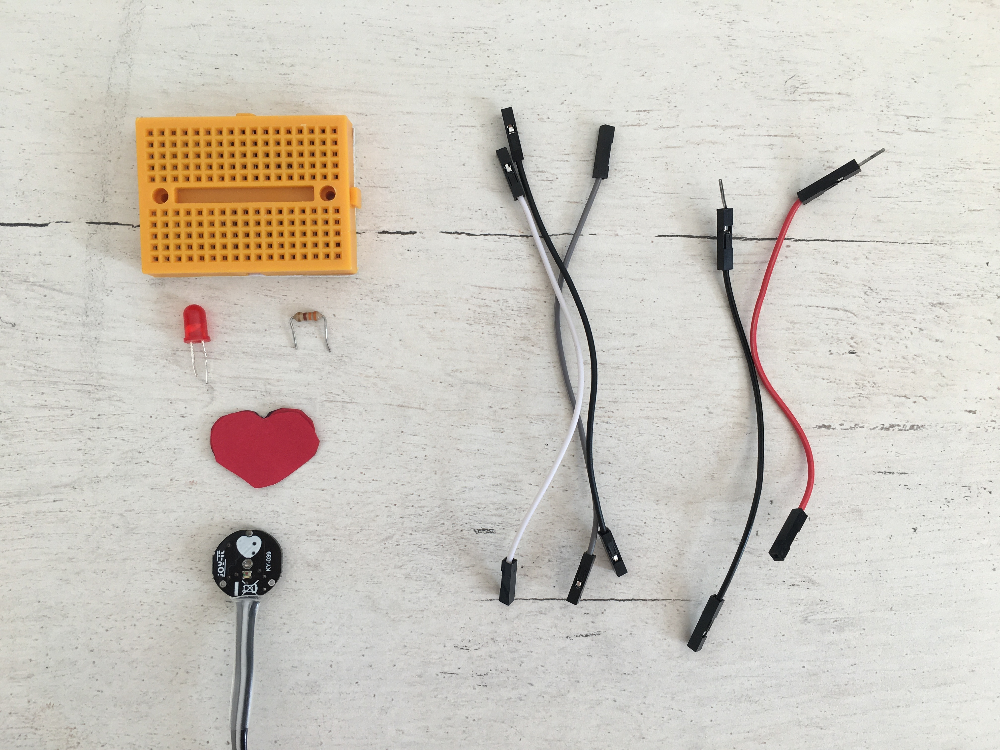
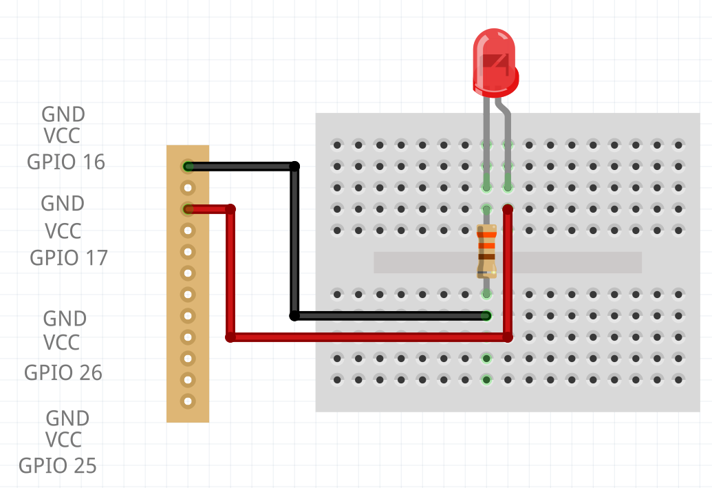
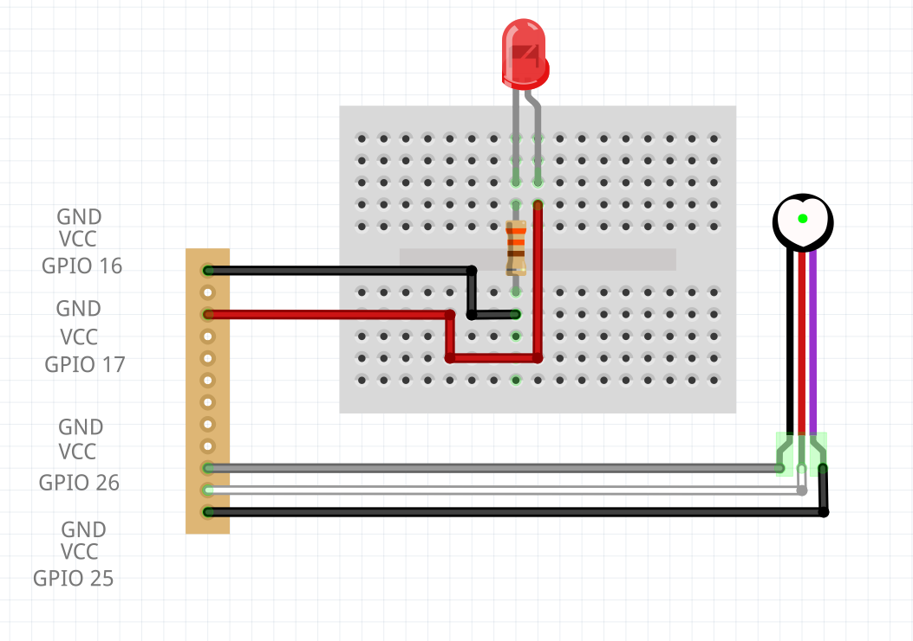
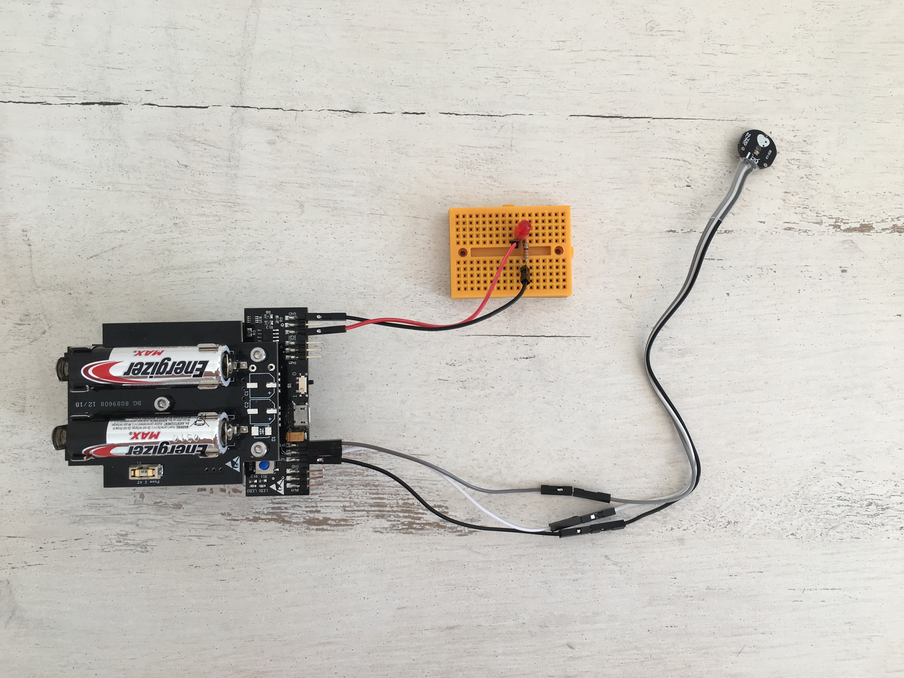
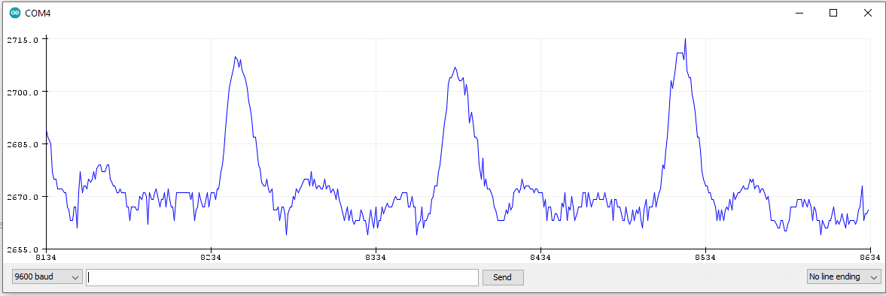

# STEP-BY-STEP
# A little heart


In this project you'll extend the bionic fish by adding a heart. For this you will add an Red LED as well as a pulse sensor to the fish. Using the pulse sensor you can make the "LED heart" of your fish pulsate to your own bodys heart rythm.

## Objectives
* You can control an LED with signals.
* You can write for-loops.
* You learn how to use pulse sensor.
* You learn how to process sensor signals with an average functions.
* You learn to deal with global and local variables.

## Material 
* 1 Microcontroller ESP32
* 1 Breadboard
* 5 Jumper cables
* 1 LED red 
* 1 Resistor 330 Ohm
* 1 Pulse sensor
* 2 Little paper hearts and some tape
* 1 3D printed part of: 3D_Structure_Light_sensor.stl (download on github)
* *A_little_heart_Start.ino* (download on github)
<br> 

 *Throughout the tutorial, do not hesitate to refer to the documentation.*

# Task 1: Flashing LED
Flash an LED and turn it on and then turn it off repeatedly. Control the power supply of the LED to turn it on and off. The ESP32 only send information to the LED. The LED send no data back to the ESP32.
<br>  <br>(C) This image was created with Fritzing.

## Wiring scheme
The picture shows the Assembly of the breadboard (grey), LED (red), 330 Ohm resistor, and ESP32 (brown) with cables.
 <br>(C) This image was created with Fritzing.

LED | Breadbord
------------ | -------------
Red | GPIO 16 
Black | GND

 *The LED must be in series with a 330 Ohm resistor.*
## Code:
1. Open the *Fish_A_little_heart_Start.ino*  file. The average function will be used in task 3. 
<br>*Don't hesitate to consult the documentation to better understand the functions used.*
2. *global variables*
<br>In order to simplify understanding of the code, a global variable is associated with each GPIO number used. Associate the variabe "PIN_LED" to the number's GPIO 16. 
3. *setup()*
<br>First, indicate the GPIO mode. Then you may notice instructions regarding the serial link. Do not hesitate to open the serial monitor.
4. *loop()*
<br>You can power on and off the LED. You can change the delay value to change the speed of the flashing.
 
# Task 2: Pulse sensor
Use the pulse sensor and visualize your heart rate on the serial tracer. When the heart pumps blood, it slightly modulates the amount of blood in the dermis (one of the three layers that make up our skin). 
The principle of the pulse sensor is to send light. This light is specially chosen to be absorbed by the blood. The blood will modulate this light which will be re-emitted by 
the skin, the sensor will send via the signal pin a data proportional to the level of reflected light. The sensor will be able to determine the blood flow and thus the heart 
rate.
<br>The pulse sensor has 3 pins: ground (grey), power supply (white) and data pin (black). 
<br> <br>(C) This image was created with Fritzing.

## Wiring scheme: 
The picture shows the Assembly of the breadboard (grey), LED (red), 330 Ohm resistor, pulse sensor and ESP32 (brown) with cables.
 <br>(C) This image was created with Fritzing.
 
LED | Breadbord
------------ | -------------
Red | GPIO 16 
Black | GND

Pulse sensor | EPS32
------------ | -------------
Black | GPIO 26 
White| 5V
Black| GND

<br> 

## Code: 
1. *global variables* 
<br>Please indicate the numbers of the new GPIO used for the pulse sensor.
<br>  *Think to change the name of the variable,a name can't be used serveral times.*
2. *setup()* 
<br>Please indicate the mode of sensor's pin.
3. *loop()*
<br>*Removes the code of the previous step from the loop*
<br>To read the data sent by the pulse sensor you can use the *analogRead* function.

```
//Reading and and display the pulse of the heart
int Value = analogRead(PIN_SENSOR);
Serial.println(Value);
```

<br><br>

# Task 3: Average function  
Add the average function to your code. 

## Wiring scheme: 
The wiring scheme is the same as task 2. 
 
## Code: 
1.*average function*
<br>You have to uncomment the average function.
<br>This function allows to calculate the average of measures during 3 secondes. First,the averaging function adds up the measurements taken by the sensor for 3 seconds using 
the loop. Then this sum is divided by the number of measurements to obtain the average. This average will be stored in a global variable.Please, complete the function at the 
noted locations: ``` /*?*/ ```
<br>2.*global variables* 
<br>Please create a variable that will save the result of the average function. 
<br>3.*loop()* 
<br>The loop () function must read and display on serial tracer the data of sensor during approximately 20 secondes (loop with 500 measures). And after, call the average 
function to calculate the average.

```
//on serial plotter 
//display the pulse of heart during 20 s ( see the average ( approximately ))
for ( int i=0; i<500; i=i+1)
{
 //Reading and and display the pulse of the heart
 int Value = analogRead(PIN_SENSOR);
 Serial.println(Value);
}
```

<br> *Check if the average value calculated matchs with the display of the pulse heart.*

# Task 4: Final code 
Change the code to illuminate the LED when a large peak is observed.

## Wiring scheme: 
 
The Wiring scheme is the same as the task 2.

## Code: 
1. *loop()* 
<br>You have to change the code to illuminate the LED when the sensor indicates a value significantly above the average. The average will be calculated every 20 seconds to 
improve the credibility of the measurements.

```
//20 secondes
for ( int y = 0; y <3000;y=y+1)
{
int Value = analogRead(PIN_SENSOR);
Serial.println(Value);
if (Value >= average+30)
{
 digitalWrite(PIN_LED,HIGH);
 delay(5);
}
digitalWrite(PIN_LED,LOW);
}
```

<br><br> Congratulations, you've coded the **A little heart** scenario successfully!
