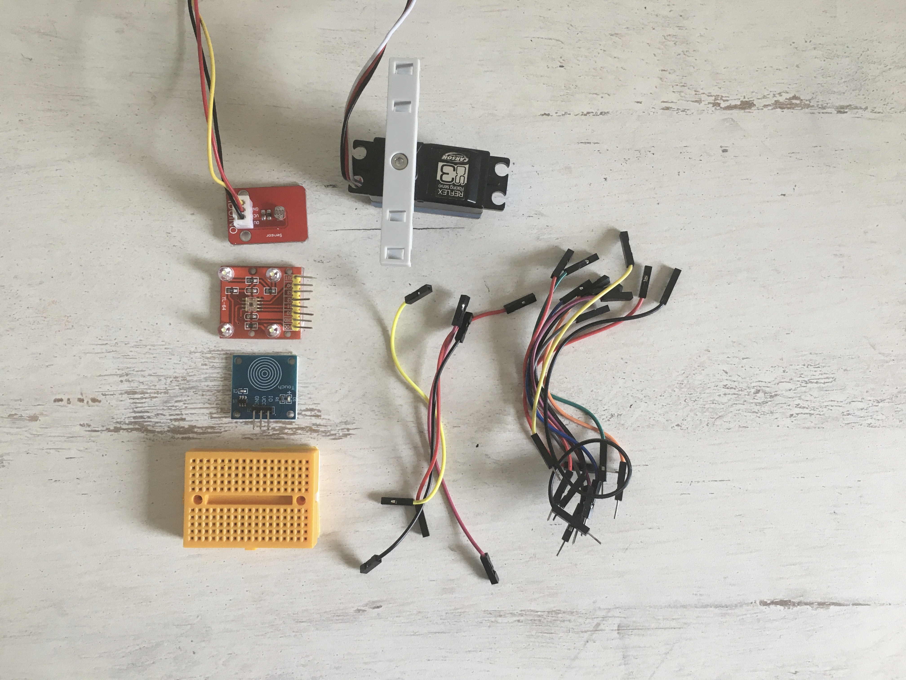
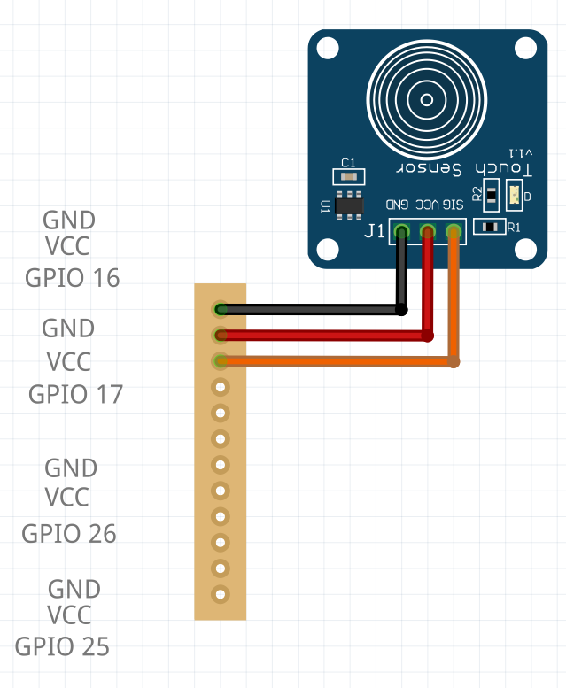
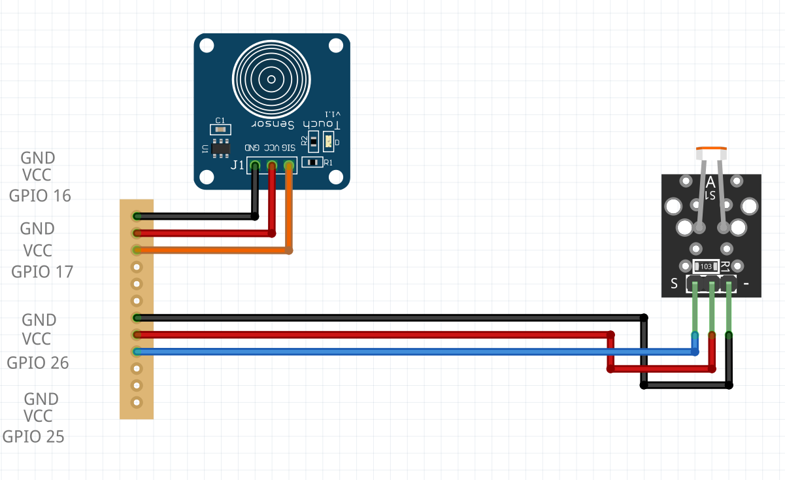
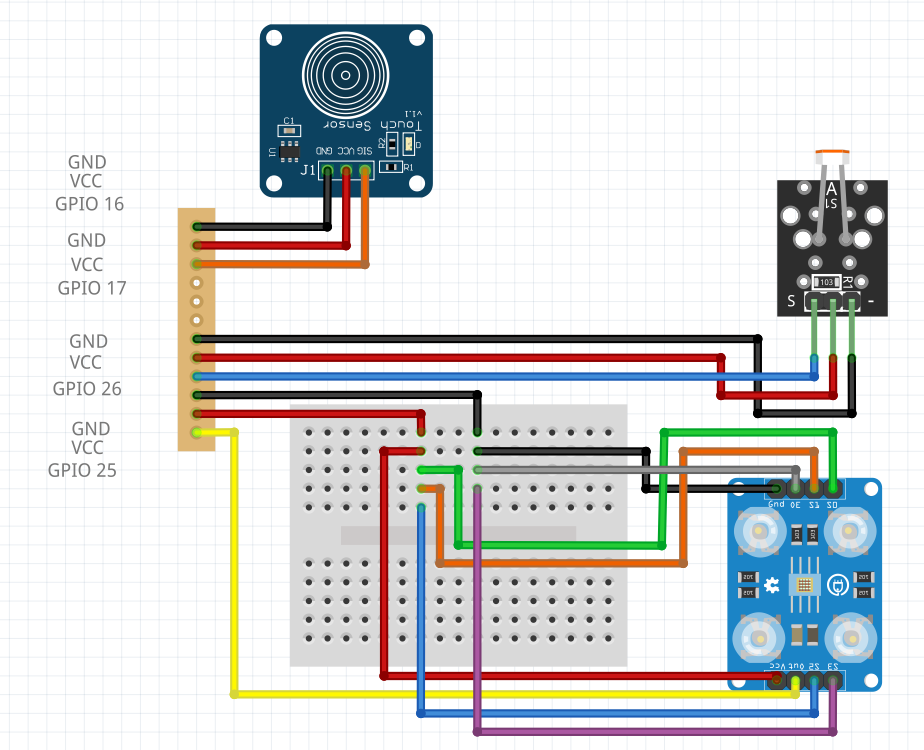
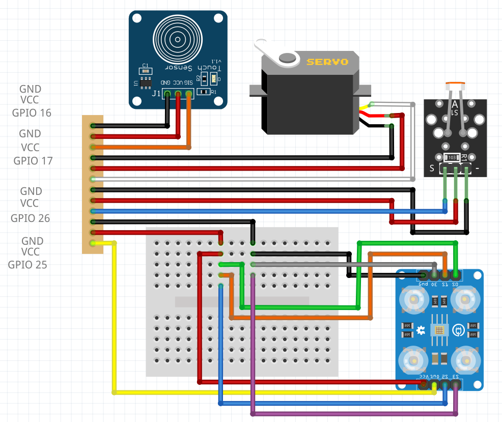
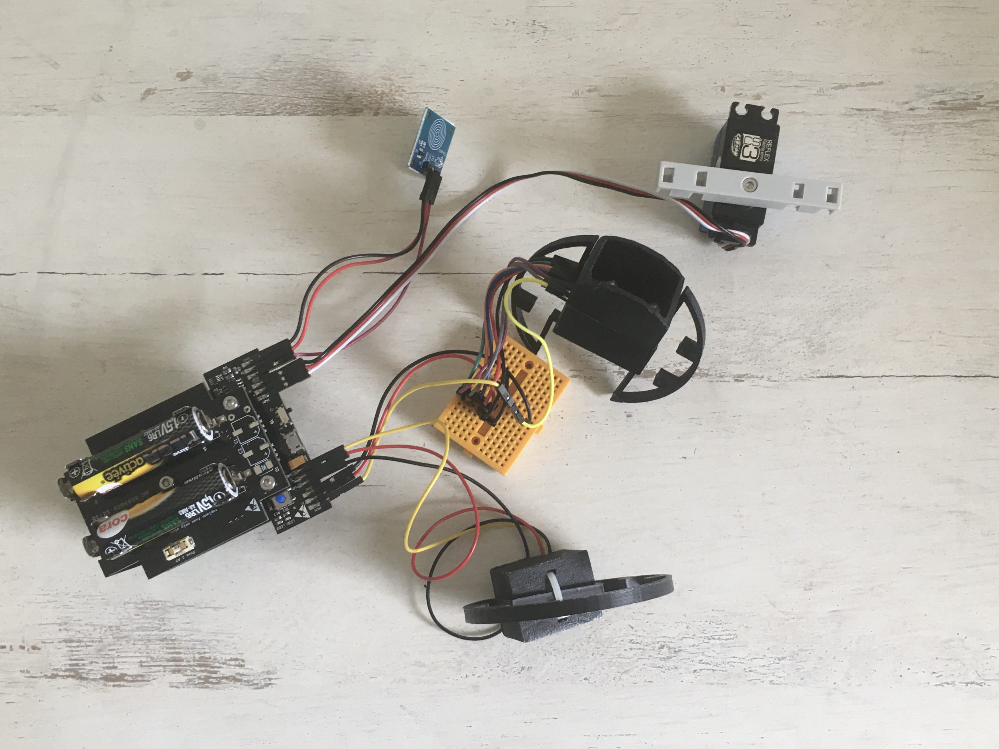

# STEP-BY-STEP 
# Swimming competition 


In this project you will play with the bionic fish in a swimming competition. What is the goal? Make your fish move as fast as possible by collecting most of the points. For that, you will use a touch sensor, a color sensor and a brightness sensor. At the beginning of each competition, a number of points are associated to each combination. It’s up to you to get the most point and move the bionic fish forward.

## Objective
* You can control an LED with signals.
* You can write for-loops.
* You can write while-loops.
* You can write if structure.
* You learn how to use touch sensor.
* You learn how to use light sensor.
* You learn how to use color sensor.
* You leran how to control servomotor. 
* You learn to deal with global and local variables.

## Material 
* 1 Microcontroller ESP32
* 1 Luminosity sensor
* 1 Color sensor
* 1 Touch sensor
* 1 Servo motor (Waterproof)
* 3 Rectangular paper: about 2 x 1 cm; color: blue, red, green
* 1 3D printed part of: 3D_Structure_Color_sensor_and_Breadboard.stl (download on github)
* 1 3D printed part of: 3D_Structure_Light_sensor.stl (download on github)
* 1 3D printed part of: Color_Box_Top.stl (download on github)
* 1 3D printed part of: Color_Box_Bottom.stl (download on github)
* 1 3D printed part of: Light_Box_Top.stl (download on github)
* 1 3D printed part of: Light_Box_Bottom.stl (download on github)
* 3 Cable ties
* *FISH_Swimming-competition_Code_Challenge.ino* (download on github)

 *Throughout the tutorial, do not hesitate to refer to the documentation.*

# Task 1: Use of LED
<br>Use the LEDs and create a function to display the player's number. 
<br>Please use the built-in LED assiocieted with the GPIO 13.

## Code:
1. Open the *FISH_Swimming-competition_Code_Challenge.ino*  file.
<br> *Don't hesitate to consult the documentation to better understand the functions used.*
2. *global variables*
<br>Complete the GPIO's number and the number of players.
3. *Function*
<br>The *player_display* function allows to indicate the number of the player who is to play. Indeed, the LED lights up as many times as the player’s number. 
<br>Complete the code to create this function.
4. *setup()*
<br>First, indicate the GPIO mode. Then you may notice instructions regarding the serial link. Do not hesitate to open the serial monitor.
5. *loop()*
<br>Please call the function *player_display* to display the number of each player.
 
# Task 2: Use the touch sensor  
<br>Use the touch sensor and create the game's structure and start the distribution of points. The touch sensor has 3 pins: ground (GND), power supply (VCC) and data pin connection (I/O). The touch sensor is a high level when a contact is detected.
<br> <br>(C) This image was created with Fritzing.

## Wiring scheme: 
The picture shows the Assembly of the breadboard (grey), LED (red), 330 Ohm resistor,the touch sensor and ESP32 (brown) with cables.
 <br>(C) This image was created with Fritzing.                       
 
Touch sensor| Breadboard 
------------ | ------------- 
I/0 | GPIO 16
GND | GND
VCC | VCC

## Code: 
1. *global variables* 
<br> First, indicate the GPIO's number used by the touch sensor.
<br> Then, definie a variable that will allow to restart the game when all players played.

```
//Restart allows to restart the loop function if it is true
boolean Restart=true;
```

<br> Lastly, you will definie two variable for the storage of points.

```
//Touch sensor
//Touch variable stores the score, randomly definied by the Touch_point()function
//when the touch sensor is a low level
int Touch;
//Touch variable stores the score, randomly definied by the Touch_point() function
//when the touch sensor is a low level
int Not_Touch;
```

2.*function*
<br> Please complete the Touch_Point() function. This function randomly assigns the points for Touch and Not_Touch variable.
<br> Please use the random function.

```
//0 or 1
int a = random(2);
```

* If *a* is equal to 0, *Touch* is equal to 0 points and *Not_Touch* is equal to 1 point.
* If not, *Touch* is equal to 1 points and *Not_Touch* is equal to 0 point.
<br> *Don't hesitate to consult the documentation to better understand how to use the conditions structure.*
3. *setup()* 
<br> Please indicate the mode of the touch sensor.
<br> *The ESP32 receives information from the touch sensor*
4. *loop()*
<br>Please read the touch value:

```
//Reading touch value
State_Touch = digitalRead(PIN_TOUCH); 
Serial.println("State Touch");
Serial.println(State_Touch);
```

<br>Please, use the following structure and complete the code to create the game's structure.

```
while (Restart == true)
{ 
 Restart=false;
 //calculates the points for the touch sensor
 Serial.println("POINTS");
 Serial.println("Touch");
 Serial.println(Touch);
 Serial.println("No Touch");
 Serial.println(Not_Touch);    
 int State_Touch;
 for (int i=1;i<=Number_player;i=i+1)
 {
  //display the player's number
  do 
  {
   //Reading Touch Value
   State_Touch = digitalRead(PIN_TOUCH);
  }
  while (State_Touch != HIGH);   
  //suspens
  delay(3000);  
  int Score = 0;     
  //reading the touch value
  if( State_Touch == 1) 
  {
  Score = Score +  Touch;
  }
  else { //?}
  Serial.println("Score");
  Serial.println(Score);
 }
 delay(10000);
 State_Touch = digitalRead(PIN_TOUCH);
 Serial.println("RESTART");
 Serial.println(State_Touch);
 if (State_Touch==HIGH)
 {
  //The game restart
  Restart=true;
 }
}
```

# Task 3: Light sensor 
Use the luminosity sensor and continue the distribution of points. The luminosity sensor has 3 pins : ground (GND), power supply (VCC) and data pin connection (OUT). The luminosity sensor 
sends to its OUT pin an analog value proportional to the amount of light. 
<br>  <br>(C) This image was created with Fritzing.

## Wiring scheme: 
The picture shows the assembly of the breadboard (grey), LED (red), 330 Ohm resistor,the touch sensor, the light sensor and ESP32 (brown) with cables.
 <br>(C) This image was created with Fritzing.
 
Touch sensor| Breadboard 
------------ | ------------- 
I/0 | GPIO 16
GND | GND
VCC | VCC
 
Light sensor | ESP32 
------------ | ------------- 
OUT | GPIO 26
VCC | 5V
GND | GND

## Code: 
1. *global variables* 
<br>Please indicate the numbers of the new GPIO used for the OUT pin of luminosity sensor. In addition, please create a global variable that will stock the value of the limit of the amount of light between day and night. I'd advise you to put the value of 200.
<br> *This value can be modified deponds on the room's light.*
<br>In addition, please define two variable for the storage of points for the light sensor.

```
//Night variable stores the score, randomly defined by the Luminosity_Poit() function
//when the luminosity value is lower than the Luminosity_Limit
int Night;
//Day variable stores the score, randomly defined by the Luminosity_Poit() function
//when the luminosity value is superior or equal than the Luminosity_Limit
int Day;
```

2. *function*
<br>Please complete the Light_Point() function. This function randomly assigns the points for Day and Night variable.
* If *a* is equal to 0, *Day* is equal to 0 points and *Night* is equal to 1 point.
* If not, *Day* is equal to 1 points and *Night* is equal to 0 point.
<br> *Don't hesitate to observe the Touch_Point() function.*
3. *setup()*
<br>Please indicate the mode of new GPIO used. 
<br> *The ESP32 receives information from the OUT pin.*
3. *loop()* 
<br>Please call the Light_Point() function and read the data from the luminosity sensor on the OUT pin and display on the serial monitor.

```
//Reading luminosity 
int Luminosity_Value = analogRead(PIN_LIGHT); 
Serial.println("Light");
Serial.println(Luminosity_Value,DEC);
```

<br>The value of the variable will be compared to the limit between day and night defined before. If the value is superior than or equal to the limit,You add the points of the 
day to the score. Otherwise, you add the points of the night to the score.
<br> *Don't hesitate to consult the documentation to better understand how to use the conditions structure.*

# Task 4: Color sensor 
Use the color sensor and send a value (proportional to the frequency) according to the color. The color sensor has 8 pins : ground (GND), supply power (VCC),configuration pins (S0,S1,S2,S3) and a data pin (OUT).
<br> <br>(C) This image was created with Fritzing.

## Wiring scheme: 
The picture shows the Assembly of the breadboard (grey), LED (red), 330 Ohm resistor,the touch sensor, the light sensor, the color sensor and ESP32 (brown) with cables.
 <br>(C) This image was created with Fritzing.

Touch sensor| Breadboard 
------------ | ------------- 
I/0 | GPIO 16
GND | GND
VCC | VCC
 
Light sensor | ESP32 
------------ | ------------- 
OUT | GPIO 26
VCC | 5V
GND | GND

Color sensor | ESP32 
------------ | ------------- 
OUT | GPIO 25
VCC | VCC
GND | GND

<br>*Please use the breadbord to connect all pins of the color sensor.*

## Code: 
1. *global variables* 
<br>Please indicate the numbers of the new GPIO used for color sensor.
<br> Then, you will definie three variables for the storage of points for the color sensor.

```
// Blue variable stores the score, randomly defined by the Color_Point() function
// when the color is blue
int Blue;
// Green variable stores the score, randomly defined by the Color_Point() function
// when the color is green
int Green;
// Red variable stores the score, randomly defined by the Color_Point() function
// when the color is red
int Red;
```

2. *function*
<br>Please uncomment the Color_Point() function. This function allows to randomly assigns the points for the Blue,Green and Red values. The table *Table_Point_Color* define the values which can be assigned for the color. If you want to change the color setting, change the values in the table.
2. *setup()*
<br> Please indicate the mode of OUT pin.
<br> *The ESP32 receives information from the color sensor.*
3. *loop()* 
<br>Please call the Color_Point() function.
<br>Please read the data from the color sensor.

```
//Reading color value
int Current_Frequency = pulseIn(PIN_COLOR, HIGH); 
Serial.println("Current_Frequency");
Serial.println(Current_Frequency);
```

<br>The value of the variable will be compared to the frequency values.
* If the value is the color value is equal to the Blue_Frequency value, you add the points of Blue to the score.
* If the value is the color value is equal to the Green_Frequency value, you add the points of Green to the score.
* If the value is the color value is equal to the Red_Frequency value, you add the points of Red to the score.
<br> *Don't hesitate to consult the documentation to better understand how to use the conditions structure.*

# Task 5: Servo motor 
Control the servo motor. 

## Wiring scheme: 
The picture shows the assembly of the breadboard (grey), LED (red), 330 Ohm resistor,the touch sensor, the light sensor, the color sensor, one servomotor and ESP32 (brown) with cables.
 <br>(C) This image was created with Fritzing.

Touch sensor| Breadboard 
------------ | ------------- 
I/0 | GPIO 16
GND | GND
VCC | VCC
 
Light sensor | ESP32 
------------ | ------------- 
OUT | GPIO 26
VCC | 5V
GND | GND

Color sensor | ESP32 
------------ | ------------- 
OUT | GPIO 25
VCC | VCC
GND | GND

Servomotor | ESP32 
------------ | ------------- 
white | GPIO 17
red | VCC
black | GND

<br>

## Code:
1. *global variables* 
<br>Please indicate the new GPIO used for the servomotor.
<br>2.*setup()*
<br>Please create the connection between the servomotor and the ESP32.

```
//match between servo motor and the number pin specified 
 servo.attach(PIN_SERVO);
```

3. *loop()* 
<br>Please create a servomotors movement to move the tail of the fish.

```
//Servo movement
for(int i=0;i<3;i=i+1)
{
 //the tail of the fish goes to one side
 servo.write(110); 
 delay(1000); 
 //the tail of the fish goes to other side
 servo.write(60); 
 delay(1000);
}
//the tail of the fish goes to the initial position
servo.write(90);
delay(1000); 
```

<br> *If the delay increase, the speed decrease.*

# Task 6: Complete the game 
Finish the game by adding a maximum score function.
 
# Wiring scheme: 
The wiring scheme is the same as the task 5.

## Code:
1. *function*
<br>Please create the max_score() function. This function returns the maximum value of an table. If there is a equality, the winner is set at random. Use this function to determine which player has the highest score.
2. *loop()* 
<br>Please define a table that stores the player's score at the start of the game.

```
// table that stores the player's score
int Table_Score[Number_player];
```

<br>Then, please create a variable *Temporization* that corresponds to the delay time between each instructions given to the servo motor. This time is given by the Score_and_speed() function: the higher the score, the lower the delay and therefore the higher the speed of the fish's tail. 
Thus, for each player, you will have to call the function Score_and_speed() function and then use the variable *Temporization* to give a more or less rapid movement to the fish.

```
int Temporization = Score_and_speed(Score);
```

<br>Once all the players have played. You can display everyone's score, then call the max_score() function and finally display the winner.
<br>For assembly, you can use the following parts to create a support for colored objects: 
<br>    
<br><br> Congratulations, you've coded the **Swimming competition** scenario successfully!
